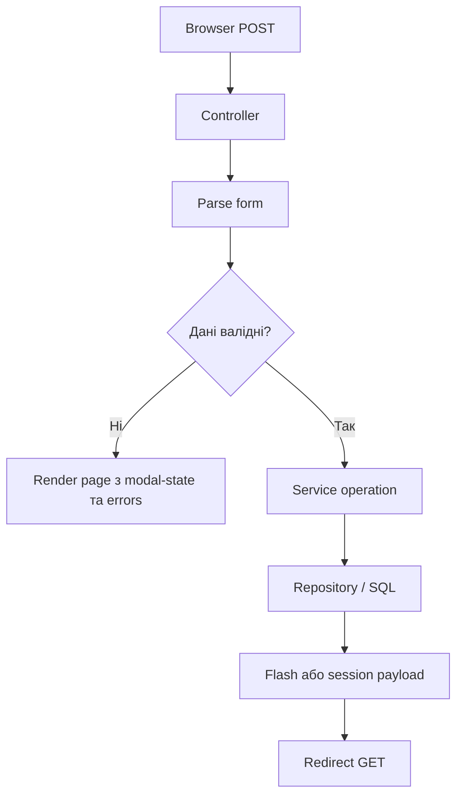

# Довідник маршрутів і сценаріїв

## 1. Призначення

Документ описує HTTP-маршрути застосунку, їх поведінку та основні сценарії використання.

## 2. Список маршрутів

| Метод | Маршрут | Призначення |
|---|---|---|
| `GET` | `/` | Дашборд |
| `GET, POST` | `/clients` | Список клієнтів + CRUD клієнтів |
| `GET, POST` | `/builds` | Список збірок + CRUD збірок |
| `GET, POST` | `/orders` | Список замовлень + CRUD замовлень |
| `GET, POST` | `/components` | Каталог компонентів + CRUD компонентів |
| `GET` | `/error/404` | Тестова сторінка 404 |
| `GET` | `/error/500` | Тестова сторінка 500 |

## 3. Маршрут `/`

Контролер:
- [dashboard_controller.py](</e:/якість та тестування пз/project/testing-software-project/app/web/controllers/dashboard_controller.py:1>)

Показує:
- статистику;
- останні замовлення;
- переходи до основних розділів.

## 4. Маршрут `/clients`

Контролер:
- [client_controller.py](</e:/якість та тестування пз/project/testing-software-project/app/web/controllers/client_controller.py:1>)

### GET

Параметри:
- `phone`
- `next`
- `edit_client_id`

Сценарії:
- відкрити список клієнтів;
- відкрити модалку редагування;
- відкрити модалку створення з підставленим телефоном.

### POST

Поле:
- `action = create | update | delete`

#### create

Очікувані поля:
- `last_name`
- `first_name`
- `birth_date`
- `phone`
- `email`

#### update

Додатково:
- `client_id`

#### delete

Потрібно:
- `client_id`

## 5. Маршрут `/builds`

Контролер:
- [build_controller.py](</e:/якість та тестування пз/project/testing-software-project/app/web/controllers/build_controller.py:1>)

### GET

Параметри:
- `edit_build_id`

### POST

Поле:
- `action = create | update | delete`

Основні поля:
- `gpu_id`
- `cpu_id`
- `motherboard_id`
- `ram_id`
- `psu_id`
- `pc_case_id`
- `build_type`

## 6. Маршрут `/orders`

Контролер:
- [order_controller.py](</e:/якість та тестування пз/project/testing-software-project/app/web/controllers/order_controller.py:1>)

### GET

Параметри:
- `phone_query`
- `created_client`
- `open_order_modal`
- `edit_order_id`

Сценарії:
- показ списку замовлень;
- показ списку клієнтів;
- відкриття order modal;
- редагування замовлення;
- повернення після створення клієнта;
- показ чека останньої операції.

### POST

Поле:
- `action = create | update | delete`

Основні поля:
- `client_id`
- `pc_build_id`
- `production_deadline`
- `payment_status`
- `order_status`

#### update

Додатково:
- `order_id`

#### delete

Потрібно:
- `order_id`

## 7. Маршрут `/components`

Контролер:
- [component_controller.py](</e:/якість та тестування пз/project/testing-software-project/app/web/controllers/component_controller.py:1>)

### GET

Параметри:
- `table`
- `edit_component_id`

### POST

Поле:
- `action = create | update | delete`

Системні поля:
- `table_name`
- `component_id`

Набір бізнес-полів залежить від таблиці:
- `GPU`
- `CPU`
- `Motherboard`
- `RAM`
- `PSU`
- `PC_Case`

## 8. Debug routes

Контролер:
- [debug_controller.py](</e:/якість та тестування пз/project/testing-software-project/app/web/controllers/debug_controller.py:1>)

### `/error/404`

Повертає кастомну `404` сторінку.

### `/error/500`

Повертає кастомну `500` сторінку.

## 9. Redirect-поведінка

Після успішного `POST` застосунок використовує патерн `POST -> Redirect -> GET`.

Це потрібно для:
- уникнення дублювання записів при `F5`;
- чистого UX після submit;
- можливості безпечно оновлювати сторінку.

## 10. Формат відповіді

Застосунок є серверно-рендерним і за замовчуванням повертає:
- HTML-сторінки;
- редіректи;
- сторінки помилок.

JSON-API для зовнішніх інтеграцій наразі не реалізоване.

## 11. Карта UI-параметрів і modal-state

Після частини дій застосунок повертає користувача на `GET`-сторінку з query-параметрами, які відкривають потрібне modal-вікно або відновлюють стан форми.

| Параметр | Сторінка | Призначення |
|---|---|---|
| `phone` | `/clients` | підставлення номера телефону у форму створення |
| `next` | `/clients` | визначення, куди повернутися після створення клієнта |
| `edit_client_id` | `/clients` | повторне відкриття modal редагування клієнта |
| `edit_build_id` | `/builds` | повторне відкриття modal редагування збірки |
| `phone_query` | `/orders` | відновлення пошуку клієнта |
| `created_client` | `/orders` | використання щойно створеного клієнта |
| `open_order_modal` | `/orders` | повторне відкриття modal замовлення |
| `edit_order_id` | `/orders` | відкриття modal редагування замовлення |

## 12. Таблиця redirect-сценаріїв

| Дія | Після успіху | Навіщо |
|---|---|---|
| створення клієнта | `GET /clients` або повернення в `/orders` | уникнути повторного POST і зберегти контекст |
| створення збірки | `GET /builds` | показати нову збірку в таблиці |
| створення замовлення | `GET /orders` | показати чек і уникнути дублювання |
| редагування сутності | `GET` тієї ж сторінки | оновити таблицю |
| видалення сутності | `GET` тієї ж сторінки | показати актуальний список |

## 13. Типовий життєвий цикл POST-маршруту

## 14. Найважливіші сценарії налагодження маршрутів

Коли певний маршрут поводиться неправильно, найчастіше проблема лежить в одному з цих місць:

1. у HTML-формі відсутній або неправильний `name`
2. форма відправляє неправильний `action`
3. `forms.py` не читає поле або перетворює його не в той тип
4. сервіс очікує іншу структуру даних
5. репозиторій використовує не ту колонку SQL
6. після успішного `POST` відсутній `redirect`
7. renderer не повертає дані для повторного відкриття modal

## 15. Особливо чутливий маршрут `/orders`

Маршрут замовлень є найбільш насиченим з погляду поведінки:

- він працює з двома головними сутностями одночасно: клієнтом і збіркою
- він використовує похідні поля: `production_time`, `due_amount`
- він повертає чек останньої операції
- він підтримує сценарій "спочатку створити клієнта, потім повернутися до замовлення"

Через це саме `/orders` є першою сторінкою, яку варто перевіряти після змін у:

- формах
- статусах
- шаблонах
- session payload
- логіці редіректів
