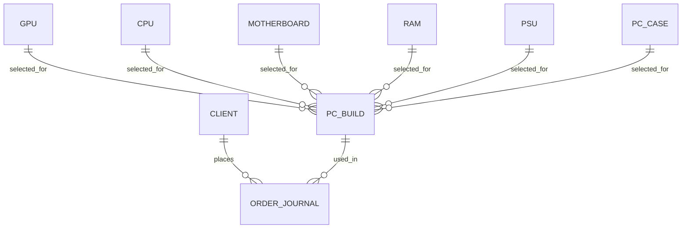

# Словник Бази Даних

## 1. Призначення документа

Цей документ є детальним словником таблиць, полів, зв'язків і службових значень у базі даних `PC Build Manager`.

Він потрібен для:

- швидкого розуміння схеми БД
- перевірки коректності мапінгу між Python-кодом і SQL
- підготовки пояснення для захисту проєкту
- подальших міграцій або розширення таблиць

## 2. Загальна карта таблиць

У системі є такі головні таблиці:

- `client`
- `gpu`
- `cpu`
- `motherboard`
- `ram`
- `psu`
- `pc_case`
- `pc_build`
- `order_journal`

## 3. Таблиця `client`

Призначення: зберігає дані клієнтів, які можуть оформлювати замовлення.

| Поле | Тип | Призначення | Коментар |
|---|---|---|---|
| `id` | `INT` | первинний ключ | автоінкремент |
| `full_name` або еквівалентна логіка складання | `VARCHAR` | повне ім'я клієнта | у веб-формі збирається з `last_name` і `first_name` |
| `birth_date` | `DATE` | дата народження | використовується як анкетне поле |
| `email` | `VARCHAR` | email клієнта | має бути у валідному форматі |
| `phone_number` або `phone` | `VARCHAR` | номер телефону | використовується для пошуку клієнта в замовленнях |

Бізнес-правила:

- телефон має бути у форматі `+380XXXXXXXXX`
- email має мати валідний домен
- дублікати телефону або email бажано блокувати на рівні БД і сервісу

## 4. Таблиця `gpu`

Призначення: каталог відеокарт.

| Поле | Тип | Призначення |
|---|---|---|
| `id` | `INT` | первинний ключ |
| `model_name` | `VARCHAR` | назва моделі |
| `manufacturer` | `VARCHAR` | виробник |
| `gpu_name` | `VARCHAR` | базове ім'я чіпа |
| `video_memory` | `INT` | обсяг відеопам'яті |
| `memory_type` | `VARCHAR` | тип пам'яті |
| `fan_count` | `INT` | кількість вентиляторів |
| `power_consumption` | `INT` | споживання енергії |
| `price` | `DECIMAL` | ціна |

## 5. Таблиця `cpu`

Призначення: каталог процесорів.

| Поле | Тип | Призначення |
|---|---|---|
| `id` | `INT` | первинний ключ |
| `model_name` | `VARCHAR` | модель CPU |
| `manufacturer` | `VARCHAR` | виробник |
| `tdp` | `INT` | теплопакет |
| `cores` | `INT` | кількість ядер |
| `threads` | `INT` | кількість потоків |
| `process_nm` | `INT` | техпроцес |
| `base_clock` | `DECIMAL` | базова частота |
| `turbo_clock` | `DECIMAL` | turbo частота |
| `compatible_ram_type` | `VARCHAR` | тип сумісної RAM |
| `price` | `DECIMAL` | ціна |

## 6. Таблиця `motherboard`

Призначення: каталог материнських плат.

| Поле | Тип | Призначення |
|---|---|---|
| `id` | `INT` | первинний ключ |
| `model_name` | `VARCHAR` | назва моделі |
| `manufacturer` | `VARCHAR` | бренд |
| `socket` | `VARCHAR` | сокет CPU |
| `chipset` | `VARCHAR` | чипсет |
| `ram_slots` | `INT` | кількість слотів RAM |
| `max_ram_frequency` | `INT` | максимальна частота RAM |
| `form_factor` | `VARCHAR` | тип плати |
| `ram_type` | `VARCHAR` | підтримуваний тип RAM |
| `price` | `DECIMAL` | ціна |

## 7. Таблиця `ram`

Призначення: каталог оперативної пам'яті.

| Поле | Тип | Призначення |
|---|---|---|
| `id` | `INT` | первинний ключ |
| `model_name` | `VARCHAR` | назва моделі |
| `manufacturer` | `VARCHAR` | бренд |
| `capacity` | `INT` | обсяг |
| `frequency` | `INT` | частота |
| `ram_type` | `VARCHAR` | тип RAM |
| `kit_count` | `INT` | кількість модулів у комплекті |
| `price` | `DECIMAL` | ціна |

## 8. Таблиця `psu`

Призначення: каталог блоків живлення.

| Поле | Тип | Призначення |
|---|---|---|
| `id` | `INT` | первинний ключ |
| `model_name` | `VARCHAR` | модель |
| `manufacturer` | `VARCHAR` | виробник |
| `power` | `INT` | потужність |
| `certificate` | `VARCHAR` | сертифікація |
| `form_factor` | `VARCHAR` | формат |
| `modularity` | `BOOLEAN` або `TINYINT` | модульність |
| `price` | `DECIMAL` | ціна |

## 9. Таблиця `pc_case`

Призначення: каталог корпусів.

| Поле | Тип | Призначення |
|---|---|---|
| `id` | `INT` | первинний ключ |
| `model_name` | `VARCHAR` | модель |
| `manufacturer` | `VARCHAR` | виробник |
| `form_factor` | `VARCHAR` | підтримуваний форм-фактор |
| `glass_side_panel` | `BOOLEAN` або `TINYINT` | наявність скляної панелі |
| `included_fans` | `INT` | кількість вентиляторів у комплекті |
| `price` | `DECIMAL` | ціна |

## 10. Таблиця `pc_build`

Призначення: зберігає готові конфігурації збірок ПК.

| Поле | Тип | Призначення | Зв'язок |
|---|---|---|---|
| `id` | `INT` | первинний ключ | |
| `gpu_id` | `INT` | FK на відеокарту | `gpu.id` |
| `cpu_id` | `INT` | FK на процесор | `cpu.id` |
| `motherboard_id` | `INT` | FK на материнську плату | `motherboard.id` |
| `ram_id` | `INT` | FK на RAM | `ram.id` |
| `psu_id` | `INT` | FK на блок живлення | `psu.id` |
| `pc_case_id` | `INT` | FK на корпус | `pc_case.id` |
| `build_type` | `VARCHAR` | тип збірки | наприклад, ігрова або бюджетна |
| `total_price` | `DECIMAL` | підсумкова ціна | похідне поле |

Особливості:

- одна збірка має рівно один компонент кожної категорії
- `total_price` є обчисленим і кешованим значенням

## 11. Таблиця `order_journal`

Призначення: журнал оформлених замовлень.

| Поле | Тип | Призначення | Коментар |
|---|---|---|---|
| `id` | `INT` | первинний ключ | |
| `client_id` | `INT` | FK на клієнта | |
| `pc_build_id` | `INT` | FK на збірку | |
| `production_time` | `INT` | виробничий час у днях | обчислюється на сервері |
| `order_date` | `DATE` або `DATETIME` | дата створення | |
| `payment_status` | `VARCHAR` або `ENUM` | статус оплати | зберігається у стабільних кодах |
| `due_amount` | `DECIMAL` | сума до сплати | 0 для оплаченого замовлення |
| `order_status` | `VARCHAR` або `ENUM` | статус готовності | зберігається у стабільних кодах |

## 12. Статусні коди і їх відображення

На рівні БД можуть використовуватись стабільні технічні коди:

### `payment_status`

| Код | Значення в UI |
|---|---|
| `paid` | Сплачено |
| `unpaid` | Не сплачено |

### `order_status`

| Код | Значення в UI |
|---|---|
| `ready` | Готово |
| `not_ready` | Не готово |

Такий підхід допомагає:

- уникати проблем кодування в БД
- не зав'язуватися на локалізований текст у бізнес-логіці
- простіше змінювати мову інтерфейсу в майбутньому

## 13. Зв'язки між таблицями

## 14. Поля, критичні для цілісності даних

Найчутливіші місця:

- `client.phone`
- `client.email`
- `pc_build.total_price`
- `order_journal.payment_status`
- `order_journal.order_status`
- `order_journal.client_id`
- `order_journal.pc_build_id`

Саме вони найчастіше впливають на:

- коректність бізнес-сценарію
- побудову UI
- можливість створення замовлення
- стабільність тестів

## 15. Потенційні покращення схеми

У майбутньому схему можна посилити:

- додати `UNIQUE` на `email` і `phone`
- формально зафіксувати статуси через `ENUM` або окремі lookup-таблиці
- додати `created_at` і `updated_at`
- додати таблицю аудиту дій
- додати таблицю сумісності компонентів
