# Технічна документація

## 1. Призначення системи

`PC Build Manager` — це інформаційна система для невеликої студії або магазину збірок ПК. Вона автоматизує:
- ведення клієнтської бази;
- каталог комплектуючих;
- створення збірок ПК з автоматичним обчисленням ціни;
- оформлення замовлень;
- відображення стану оплати та готовності;
- базову адміністративну аналітику через дашборд.

Система орієнтована на локальний або навчальний сценарій використання, але має структуру, достатню для подальшого розвитку.

## 2. Технологічний стек

### Backend

- `Python 3`
- `Flask 3.1.0`
- `PyMySQL 1.1.1`

### Frontend

- `Jinja2` шаблони
- `HTML5`
- `CSS3`
- `Vanilla JavaScript` з модульною структурою

### Data layer

- `MySQL`
- SQL-скрипт ініціалізації: [init_db.sql](</e:/якість та тестування пз/project/testing-software-project/init_db.sql>)

### Testing

- `pytest 8.3.5`

### Containerization

- `Dockerfile`
- `docker-compose.yaml`

## 3. Архітектурний стиль

Проєкт побудований за принципом багаторівневої архітектури з елементами `MVC` на web-рівні.

### Шари

1. `Presentation/Web`
2. `Application/Service`
3. `Persistence/Repository`
4. `Infrastructure`

### Загальна схема

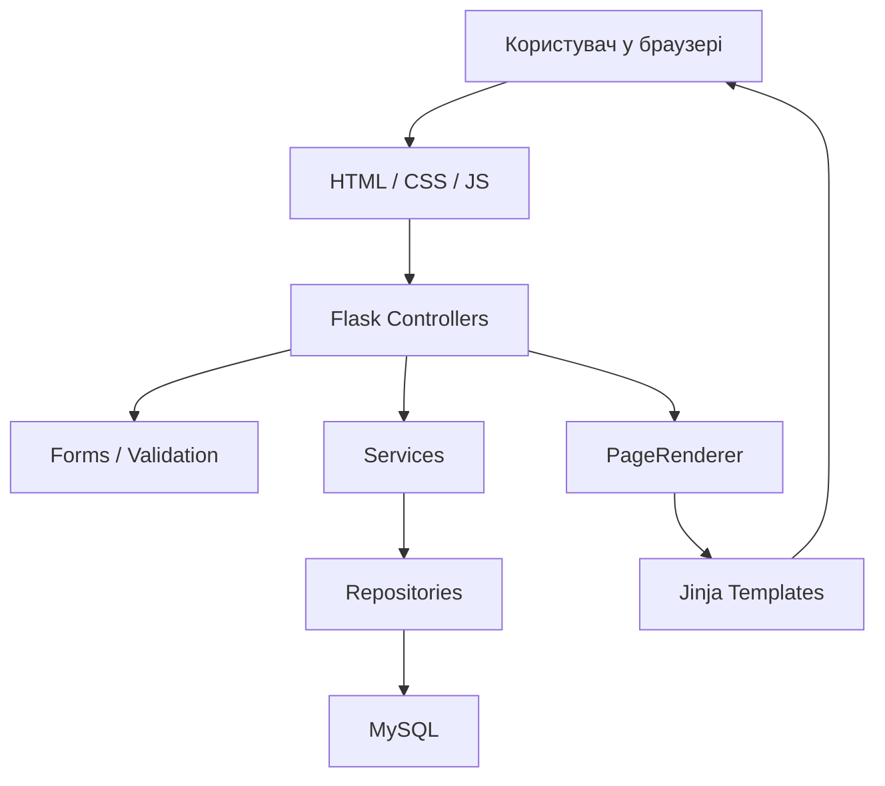

### Життєвий цикл запиту

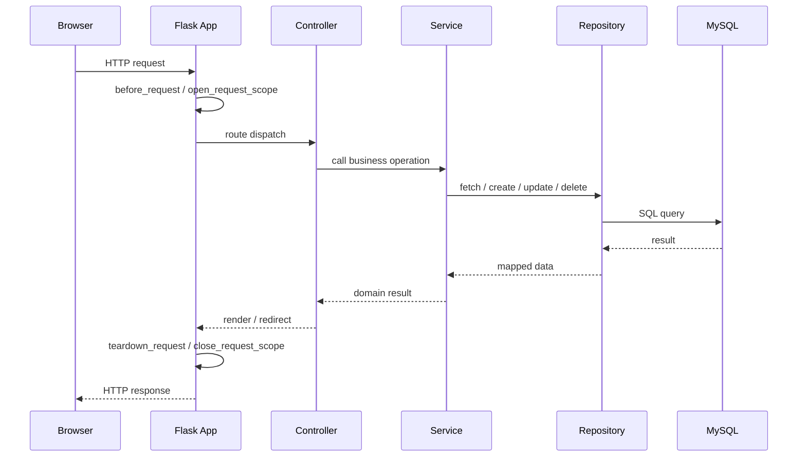

## 4. Структура каталогів

```text
app/
  config.py
  exceptions.py
  models.py
  infrastructure/
    database.py
  repositories/
    client_repository.py
    component_repository.py
    order_repository.py
    pc_build_repository.py
  services/
    client_service.py
    component_service.py
    order_service.py
    pc_build_service.py
  static/
    styles.css
    js/
      app.js
      modals.js
      orders.js
      previews.js
      shell.js
      tables.js
      toasts.js
      utils.js
  templates/
    base.html
    dashboard.html
    clients.html
    builds.html
    components.html
    orders.html
    error.html
  web/
    app.py
    dependencies.py
    forms.py
    rendering.py
    runtime.py
    serializers.py
    controllers/
      __init__.py
      dashboard_controller.py
      client_controller.py
      build_controller.py
      component_controller.py
      order_controller.py
      debug_controller.py
tests/
main.py
init_db.sql
Dockerfile
docker-compose.yaml
```

## 5. Backend по файлах

### 5.1. [main.py](</e:/якість та тестування пз/project/testing-software-project/main.py>)

Точка входу застосунку.

Відповідальність:
- зчитати конфігурацію БД;
- створити Flask app;
- запустити dev server.

### 5.2. [app/config.py](</e:/якість та тестування пз/project/testing-software-project/app/config.py>)

Відповідає за:
- `DatabaseConfig`;
- читання `.env`;
- читання `DB_HOST`, `DB_USER`, `DB_PASSWORD`, `DB_NAME`;
- нормалізацію значень із лапками;
- секретний ключ застосунку.

### 5.3. [app/models.py](</e:/якість та тестування пз/project/testing-software-project/app/models.py>)

Містить dataclass-моделі:
- `ClientRegistration`
- `ClientSummary`
- `ComponentOption`
- `PcBuildRequest`
- `BuildSummary`
- `OrderRequest`
- `OrderReceipt`
- `OrderSummary`
- `DashboardStats`

Ці моделі використовуються як DTO між шарами.

### 5.4. [app/web/app.py](</e:/якість та тестування пз/project/testing-software-project/app/web/app.py>)

Створює та конфігурує Flask-застосунок.

Функції:
- створення `Flask`;
- підключення `SECRET_KEY`;
- `before_request` для відкриття request-scope;
- `teardown_request` для закриття scope;
- глобальні сторінки помилок `404` і `500`;
- реєстрація всіх маршрутів.

### 5.5. [app/web/runtime.py](</e:/якість та тестування пз/project/testing-software-project/app/web/runtime.py>)

Організовує життєвий цикл підключення до БД на рівні одного HTTP-запиту.

### 5.6. [app/web/dependencies.py](</e:/якість та тестування пз/project/testing-software-project/app/web/dependencies.py>)

Створює `ServiceContainer` та зв’язує:
- repositories;
- services;
- database connection.

### 5.7. [app/web/forms.py](</e:/якість та тестування пз/project/testing-software-project/app/web/forms.py>)

Містить:
- парсинг build-форми;
- парсинг order-форми;
- складання client registration;
- regex-валідацію телефону й email;
- валідацію обмежень форми клієнта.

### 5.8. [app/web/rendering.py](</e:/якість та тестування пз/project/testing-software-project/app/web/rendering.py>)

Містить `PageRenderer`.

Завдання:
- зібрати контекст сторінок;
- сховати довгі списки параметрів `render_template`;
- централізувати формування view-state;
- формувати контекст для модалок, статусів, preview і таблиць.

### 5.9. Контролери

#### [dashboard_controller.py](</e:/якість та тестування пз/project/testing-software-project/app/web/controllers/dashboard_controller.py>)
- маршрут головної сторінки;
- передає дані дашборду.

#### [client_controller.py](</e:/якість та тестування пз/project/testing-software-project/app/web/controllers/client_controller.py>)
- CRUD клієнтів;
- inline-помилки;
- перехід у сценарій створення клієнта із замовлення.

#### [build_controller.py](</e:/якість та тестування пз/project/testing-software-project/app/web/controllers/build_controller.py>)
- CRUD збірок;
- обробка форми вибору комплектуючих;
- редіректи після створення/оновлення.

#### [component_controller.py](</e:/якість та тестування пз/project/testing-software-project/app/web/controllers/component_controller.py>)
- CRUD компонентів;
- робота з різними таблицями через `table_name`.

#### [order_controller.py](</e:/якість та тестування пз/project/testing-software-project/app/web/controllers/order_controller.py>)
- CRUD замовлень;
- обробка order receipt;
- session-state для останнього чека;
- формування `production_deadline`.

#### [debug_controller.py](</e:/якість та тестування пз/project/testing-software-project/app/web/controllers/debug_controller.py>)
- маршрути для перевірки custom error pages.

## 6. Repository layer

### [client_repository.py](</e:/якість та тестування пз/project/testing-software-project/app/repositories/client_repository.py>)
- `create`
- `update`
- `delete`
- `list_all`
- `get_by_id`
- `find_by_phone`

### [component_repository.py](</e:/якість та тестування пз/project/testing-software-project/app/repositories/component_repository.py>)
- generic CRUD по таблицях `GPU`, `CPU`, `Motherboard`, `RAM`, `PSU`, `PC_Case`;
- whitelist дозволених полів;
- захист від довільних SQL-таблиць.

### [pc_build_repository.py](</e:/якість та тестування пз/project/testing-software-project/app/repositories/pc_build_repository.py>)
- CRUD збірок;
- `get_total_price`;
- `get_component_summary`.

### [order_repository.py](</e:/якість та тестування пз/project/testing-software-project/app/repositories/order_repository.py>)
- CRUD замовлень;
- `list_all`
- `get_by_id`

## 7. Service layer

### ClientService

Обов’язки:
- реєстрація клієнта;
- оновлення й видалення;
- побудова view-model для форми;
- розділення `full_name` на прізвище та ім’я для UI.

### PcBuildService

Обов’язки:
- побудова `BuildSummary`;
- валідація існування обраних компонентів;
- CRUD збірок;
- побудова select-options для модалок.

### OrderService

Обов’язки:
- перевірка клієнта;
- перевірка збірки;
- валідація статусів;
- обчислення `due_amount`;
- створення receipt;
- CRUD замовлень;
- статистика дашборду.

### ComponentService

Обов’язки:
- централізована конфігурація всіх типів компонентів;
- опис полів і таблиць;
- побудова секцій каталогу;
- універсальна валідація полів;
- конвертація `text/number/boolean`;
- CRUD компонентів.

## 8. Frontend architecture

### JS-модулі

- [app/static/js/app.js](</e:/якість та тестування пз/project/testing-software-project/app/static/js/app.js>) — головний bootstrap
- [modals.js](</e:/якість та тестування пз/project/testing-software-project/app/static/js/modals.js>) — відкриття/закриття модалок
- [orders.js](</e:/якість та тестування пз/project/testing-software-project/app/static/js/orders.js>) — state модалок сторінок
- [previews.js](</e:/якість та тестування пз/project/testing-software-project/app/static/js/previews.js>) — live-preview збірок і замовлень
- [shell.js](</e:/якість та тестування пз/project/testing-software-project/app/static/js/shell.js>) — shell/layout поведінка
- [tables.js](</e:/якість та тестування пз/project/testing-software-project/app/static/js/tables.js>) — сортування, фільтрація, пагінація
- [toasts.js](</e:/якість та тестування пз/project/testing-software-project/app/static/js/toasts.js>) — toast-повідомлення
- [utils.js](</e:/якість та тестування пз/project/testing-software-project/app/static/js/utils.js>) — допоміжні функції

### UI-підхід

- один shell-layout;
- темна dashboard-стилістика;
- модальні форми;
- адаптивні таблиці;
- sticky mobile FAB;
- branded error pages.

## 9. База даних

### ER-схема

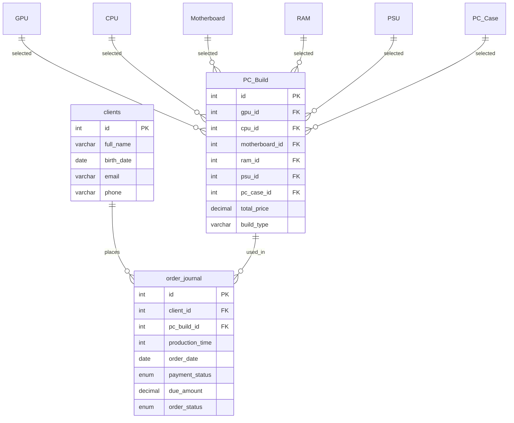

### Таблиці

- `clients`
- `GPU`
- `CPU`
- `Motherboard`
- `RAM`
- `PSU`
- `PC_Case`
- `PC_Build`
- `order_journal`

### Тригери

У [init_db.sql](</e:/якість та тестування пз/project/testing-software-project/init_db.sql:1>) є два тригери:
- `trg_pc_build_insert`
- `trg_pc_build_update`

Вони автоматично перераховують `total_price` збірки як суму цін усіх компонентів.

### Статуси замовлень

`payment_status`:
- `paid`
- `unpaid`

`order_status`:
- `ready`
- `not_ready`

У UI ці коди мапляться на українські підписи.

## 10. Валідація

### Клієнт

- `last_name` — обов’язкове
- `first_name` — обов’язкове
- `birth_date` — обов’язкове
- `phone` — regex `^\+380\d{9}$`
- `email` — regex для адреси виду `name@example.com`

### Замовлення

- дата завершення має бути в майбутньому;
- дата завершення має бути не далі 365 днів;
- клієнт і збірка обов’язкові;
- статуси оплати/готовності перевіряються через whitelist.

### Збірка

- усі компоненти мають існувати в БД;
- `build_type` не може бути порожнім.

### Компоненти

- кожне поле обов’язкове;
- `number` конвертується в `int/float`;
- `boolean` підтримує `true/false`, `1/0`, `yes/no`.

## 11. Обробка помилок

Система має кастомні сторінки:
- `404 Not Found`
- `500 Internal Server Error`

Тестові маршрути:
- `/error/404`
- `/error/500`

## 12. CRUD-можливості

### Клієнти
- create
- read
- update
- delete

### Збірки
- create
- read
- update
- delete

### Замовлення
- create
- read
- update
- delete

### Комплектуючі
- create
- read
- update
- delete

## 13. Тестування

Файл тестів:
- [tests/test_web_app.py](</e:/якість та тестування пз/project/testing-software-project/tests/test_web_app.py:1>)

Покриває:
- відкриття сторінок;
- створення клієнтів;
- валідацію форми клієнта;
- regex-валідацію телефону та email;
- створення/оновлення/видалення збірок;
- створення/оновлення/видалення замовлень;
- CRUD комплектуючих;
- custom `404` і `500`.

## 14. Контейнеризація

### [Dockerfile](</e:/якість та тестування пз/project/testing-software-project/Dockerfile>)

Використовується для збирання контейнера застосунку.

### [docker-compose.yaml](</e:/якість та тестування пз/project/testing-software-project/docker-compose.yaml>)

Піднімає:
- MySQL
- web application

## 15. Відомі технічні обмеження

- застосунок запускається через Flask development server, якщо стартувати `py main.py`;
- частина файлів усе ще містить проблеми кодування в окремих рядках;
- тести виконуються без справжньої БД на fake services;
- `pytest` у поточному середовищі не завжди може створювати `.pytest_cache`.

## 16. Рекомендації для подальшого розвитку

1. Почистити всі залишки битого кодування.
2. Винести повторюваний CRUD-flow контролерів у спільні helper-и.
3. Розбити `ComponentService` на кілька менших модулів.
4. Додати справжні integration tests із тестовою БД.
5. Додати authentication/roles при переході від навчального до production-сценарію.

## 17. Деталізований розбір доменних сценаріїв

### 17.1. Сценарій створення клієнта

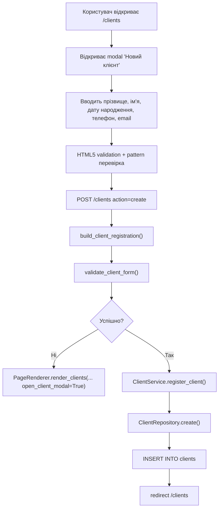

### 17.2. Сценарій створення збірки

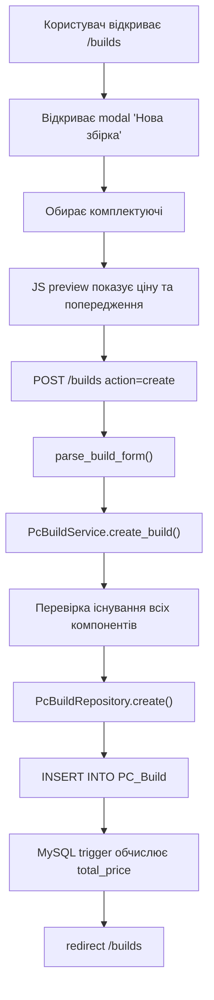

### 17.3. Сценарій створення замовлення

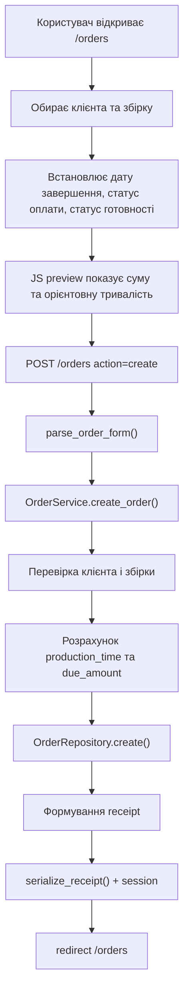

### 17.4. Сценарій роботи з комплектуючими

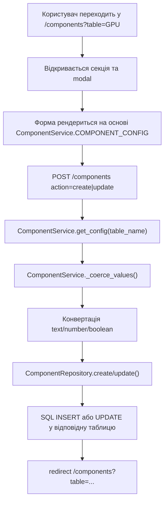

## 18. Глибокий опис конфігурації застосунку

### 18.1. Конфігурація БД

`DatabaseConfig` складається з:
- `host`
- `user`
- `password`
- `database`

Ключові особливості:
- пароль до БД не хардкодиться;
- `.env` читається вручну без сторонніх бібліотек;
- підтримуються значення в лапках;
- якщо пароль порожній, застосунок не стартує.

### 18.2. Конфігурація Flask

У [app/web/app.py](</e:/якість та тестування пз/project/testing-software-project/app/web/app.py:1>) налаштовуються:
- `template_folder`
- `static_folder`
- `DATABASE_CONFIG`
- `SECRET_KEY`
- `JSON_AS_ASCII = False`

### 18.3. Конфігурація запуску

У [main.py](</e:/якість та тестування пз/project/testing-software-project/main.py:1>) використовуються:
- `APP_HOST`
- `APP_PORT`
- `FLASK_DEBUG`

## 19. Детальний словник сутностей

### 19.1. Клієнт

Призначення:
- представляє фізичну особу, яка замовляє збірку ПК.

Поля:
- `id` — технічний ідентифікатор;
- `full_name` — повне ім’я в БД;
- `birth_date` — дата народження;
- `email` — унікальна електронна адреса;
- `phone` — унікальний телефон.

У UI:
- `full_name` розбивається на `last_name` та `first_name`.

### 19.2. Компонент

Призначення:
- представляє одиницю каталогу заліза.

Типи:
- GPU
- CPU
- Motherboard
- RAM
- PSU
- PC_Case

Особливість:
- немає єдиної універсальної таблиці `components`;
- замість цього кожен тип має власну таблицю та власний набір полів.

### 19.3. Збірка ПК

Призначення:
- зв’язує шість типів компонентів в одну конфігурацію.

Поля:
- `gpu_id`
- `cpu_id`
- `motherboard_id`
- `ram_id`
- `psu_id`
- `pc_case_id`
- `total_price`
- `build_type`

Особливість:
- `total_price` не вводиться вручну;
- значення встановлюється MySQL trigger-ом.

### 19.4. Замовлення

Призначення:
- фіксує факт замовлення конкретної збірки конкретним клієнтом.

Поля:
- `client_id`
- `pc_build_id`
- `production_time`
- `order_date`
- `payment_status`
- `due_amount`
- `order_status`

Особливість:
- у формі замовлення користувач вводить `production_deadline`, а не `production_time`;
- `production_time` обчислюється на сервері автоматично.

## 20. Dependency map

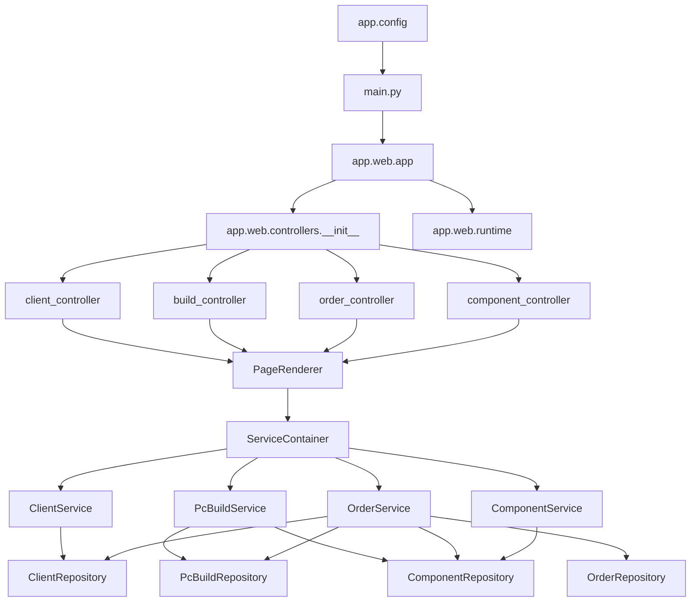

## 21. Докладна матриця відповідальності

| Шар | Основна відповідальність | Чого не повинен робити |
|---|---|---|
| `controllers` | приймати HTTP-запит, читати form/query, викликати service, повертати render/redirect | не виконувати SQL, не містити велику бізнес-логіку |
| `forms` | парсинг і валідація вхідних значень | не виконувати SQL, не рендерити сторінки |
| `rendering` | формування контексту шаблонів | не змінювати БД |
| `services` | бізнес-правила, узгодження сценарію | не працювати напряму з HTTP |
| `repositories` | SQL-запити та commit | не містити UI або HTTP |
| `templates` | представлення даних | не містити бізнес-логіку з побічними ефектами |
| `static/js` | клієнтська інтерактивність | не дублювати серверні правила цілісності як єдине джерело істини |

## 22. Детальна таблиця валідації

| Сутність | Поле | Тип | Правило | Де перевіряється |
|---|---|---|---|---|
| Client | `last_name` | text | not empty | `forms.py`, HTML `required` |
| Client | `first_name` | text | not empty | `forms.py`, HTML `required` |
| Client | `birth_date` | date | not empty | `forms.py`, HTML `required` |
| Client | `phone` | tel | `^\+380\d{9}$` | HTML `pattern`, `forms.py` |
| Client | `email` | email | address with domain | HTML `pattern`, `forms.py` |
| Build | component ids | int | must exist in DB | `PcBuildService` |
| Build | `build_type` | text | not empty | `PcBuildService` |
| Order | `production_deadline` | datetime | future, <=365 days | `forms.py` |
| Order | `payment_status` | enum | whitelist | `OrderService` |
| Order | `order_status` | enum | whitelist | `OrderService` |
| Component | field value | mixed | not empty + type cast | `ComponentService` |

## 23. Деталізація тестового покриття

### 23.1. Типи тестів

Поточний набір тестів є змішаним:
- route-level tests через Flask test client;
- unit-подібні перевірки сценаріїв на fake services;
- перевірки UX-сигналів у HTML.

### 23.2. Що саме перевіряють тести

1. Завантаження сторінок.
2. Створення записів через POST.
3. Роботу `POST -> Redirect -> GET`.
4. Збереження modal-state.
5. Inline-помилки.
6. Custom error pages.
7. CRUD-команди для всіх основних сутностей.
8. Regex-валідацію email і телефону.

### 23.3. Чого тести поки не перевіряють

- справжню взаємодію з реальною MySQL;
- поведінку тригерів у live-БД;
- browser-level JavaScript interactions;
- візуальні регресії;
- accessibility на рівні DOM/browser tooling.

## 24. Детальний опис обмежень поточної реалізації

### 24.1. Кодування

Частина старих рядків у Python-файлах і SQL-скриптах усе ще має наслідки проблем кодування. Це не завжди ламає логіку, але:
- ускладнює підтримку;
- може давати некрасиві тексти;
- погіршує якість документації в консольному перегляді.

### 24.2. Тип запуску

Система все ще орієнтована на:
- локальний запуск;
- навчальний сценарій;
- ручну підготовку БД.

### 24.3. Міграції

Окремий механізм міграцій типу `Alembic` відсутній. Стан схеми контролюється через один SQL-скрипт.

### 24.4. Безпека

Конфігурація пароля винесена з коду, але:
- немає системи ролей;
- немає авторизації;
- немає захисту від CSRF;
- немає production-grade секрет-менеджменту.

## 25. Дорожня карта розвитку

### Етап 1. Технічна чистка

- прибрати всі пошкоджені рядки кодування;
- винести повторювані controller helpers;
- вирівняти стиль повідомлень.

### Етап 2. Якість і стабільність

- додати інтеграційні тести з реальною тестовою БД;
- додати репорт покриття;
- додати lint/format pipeline.

### Етап 3. Production-readiness

- перейти на WSGI/ASGI сервер;
- додати ролі та доступ;
- додати CSRF і базову auth;
- додати міграції схеми.

### Етап 4. Розвиток продукту

- окремий каталог сумісності комплектуючих;
- фільтрація по брендах, сокетах, типах RAM;
- друк чека / PDF;
- журнал дій адміністратора;
- пошук замовлень за статусом і датою.

## 26. Детальні послідовності по основних сценаріях

### 26.1. Створення клієнта

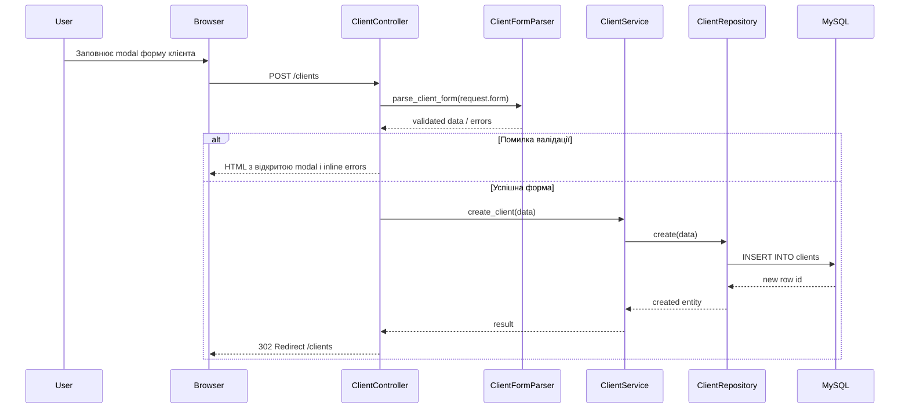

### 26.2. Створення збірки

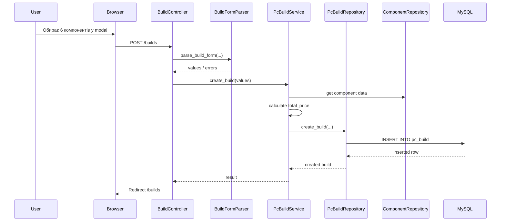

### 26.3. Створення замовлення

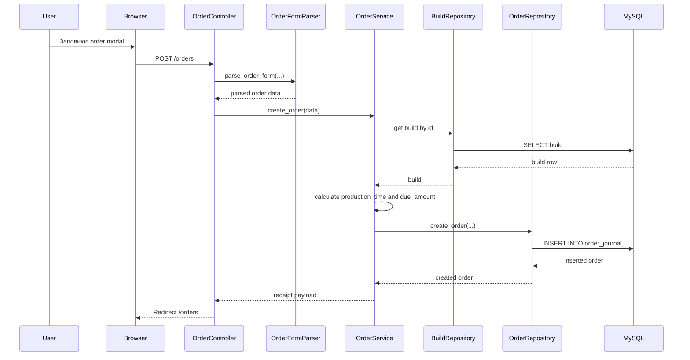

## 27. Повний словник технічних ролей файлів

| Шлях | Роль |
|---|---|
| `main.py` | стартова точка запуску |
| `app/config.py` | зчитування конфігурації та `.env` |
| `app/models.py` | DTO та допоміжні моделі даних |
| `app/exceptions.py` | доменні винятки |
| `app/infrastructure/database.py` | фабрика з'єднань з MySQL |
| `app/repositories/*.py` | SQL доступ до даних |
| `app/services/*.py` | бізнес-правила і координація |
| `app/web/app.py` | Flask application factory і реєстрація blueprint-ів |
| `app/web/dependencies.py` | збирання сервісного контейнера |
| `app/web/forms.py` | парсинг і валідація форм |
| `app/web/rendering.py` | page renderer і складання template context |
| `app/web/runtime.py` | request-scoped ресурси |
| `app/web/serializers.py` | перетворення об'єктів у JSON/словники |
| `app/web/controllers/*.py` | маршрути і HTTP orchestration |
| `app/templates/*.html` | Jinja-шаблони |
| `app/static/js/*.js` | модулі клієнтського інтерфейсу |
| `tests/*.py` | unit та integration тести |

## 28. Матриця ризиків і точок відмови

| Ризик | Де виникає | Наслідок | Поточний захист |
|---|---|---|---|
| Відсутній пароль БД | `config.py` | застосунок не стартує | явна перевірка й зрозуміла помилка |
| Невалідний email | `forms.py` | сміттєві дані клієнта | regex + inline помилка |
| Невалідний телефон | `forms.py` | сміттєві дані клієнта | regex + inline помилка |
| Повторний POST | контролери | дублювання записів | PRG pattern |
| Втрата modal state | контролери/renderer | поганий UX | повторне відкриття modal |
| Падіння неіснуючого URL | Flask routing | 404 | кастомна error page |
| Внутрішній виняток сервера | будь-який шар | 500 | кастомна error page |
| Некоректна дата завершення | order form | помилка створення | server-side validation |
| `NULL total_price` | build/order data | злам preview/замовлення | захист на рівні сервісу і репозиторію |

## 29. Пояснення вибору рішень

### 29.1. Чому Flask

Flask обрано як легкий фреймворк, який:

- не приховує логіку під великим магічним стеком
- зручний для навчального проєкту
- добре підходить для невеликого CRUD-застосунку
- дозволяє поступово ускладнювати архітектуру

### 29.2. Чому без ORM

У цьому проєкті прямий SQL доцільний, бо:

- схема невелика і прозора
- SQL легко показати і пояснити в документації
- менше абстракцій для навчальної демонстрації

### 29.3. Чому не SPA

Серверний рендеринг через Jinja дає:

- простіший стек
- менше клієнтської складності
- прогнозованіші форми і редіректи
- легший контроль над page state в невеликому проєкті

## 30. Рекомендації до читання коду

Якщо новий розробник заходить у проєкт, зручно вивчати код у такому порядку:

1. `main.py`
2. `app/web/app.py`
3. `app/web/controllers/*`
4. `app/web/forms.py`
5. `app/services/*`
6. `app/repositories/*`
7. `app/templates/*`
8. `app/static/js/*`

Такий порядок дає швидке розуміння повного шляху:

- від HTTP-запиту
- через валідацію
- до бізнес-логіки
- далі до БД
- і назад у HTML-відповідь

## 31. Карта template context по сторінках

Цей розділ корисний для швидкого розуміння, які дані взагалі отримує кожен шаблон.

### 31.1. `dashboard.html`

Типові ключі контексту:

- агрегована статистика
- список останніх замовлень
- значення для карток dashboard
- дані для навігаційного shell

### 31.2. `clients.html`

Типові ключі:

- список клієнтів
- значення поточної форми
- inline-помилки
- прапор відкриття create/update modal
- ідентифікатор клієнта для редагування

### 31.3. `builds.html`

Типові ключі:

- список збірок
- список доступних компонентів по категоріях
- значення форми редагування або створення
- preview стан modal-вікна

### 31.4. `orders.html`

Типові ключі:

- список замовлень
- список клієнтів
- список збірок
- receipt останньої операції
- query state для повторного відкриття modal
- попередньо вибраний клієнт або збірка

### 31.5. `components.html`

Типові ключі:

- активна таблиця компонентів
- список записів вибраної категорії
- схема полів для create/update modal
- дані поточного редагованого запису

## 32. Довідник по modal-state механіці

Modal-state є важливою частиною UX і водночас одним з найчутливіших місць застосунку.

### 32.1. Навіщо вона потрібна

Без збереження modal-state користувач при помилці:

- втрачав би контекст
- мав би заново відкривати форму
- міг би втрачати вже введені дані

### 32.2. Як вона реалізована

Стан відновлюється комбінацією:

- query parameters
- template flags
- form values
- клієнтського JavaScript, який читає page state

### 32.3. Де можливі збої

Найчастіші помилки в цій зоні:

- modal не відкривається після redirect
- поля не зберігають введені значення
- відкривається не та modal
- редагування плутається зі створенням

## 33. Довідник по receipt і preview-моделі

Проєкт використовує не лише CRUD-таблиці, а й проміжні представлення даних для UI.

### 33.1. Preview збірки

Потрібен для:

- показу загальної ціни до збереження
- формування UX-підтвердження
- підготовки користувача до створення запису

### 33.2. Preview замовлення

Містить:

- клієнта
- збірку
- статуси
- дату завершення
- похідний `production_time`
- суму до сплати

### 33.3. Receipt останньої операції

Використовується після успішного створення замовлення, щоб користувач одразу бачив результат дії.

## 34. Дерево діагностики типових проблем

### 34.1. Якщо не працює створення клієнта

Перевірити:

1. чи є `DB_PASSWORD`
2. чи проходить regex email
3. чи проходить regex phone
4. чи відкривається modal після помилки
5. чи немає дубля по email або телефону

### 34.2. Якщо не працює створення збірки

Перевірити:

1. чи завантажуються всі dropdown-списки
2. чи вибрані всі 6 компонентів
3. чи сервіс коректно рахує `total_price`
4. чи не містить БД порожніх або пошкоджених рядків

### 34.3. Якщо не працює створення замовлення

Перевірити:

1. чи існує клієнт
2. чи існує збірка
3. чи валідна дата завершення
4. чи статуси відповідають очікуваним кодам
5. чи формується receipt payload

## 35. Пояснення зв'язку документації з кодом

Цей пакет документації варто сприймати як багатошарове пояснення:

- `README.md` дає швидкий старт
- `TECHNICAL_DOCUMENTATION.md` дає архітектурну картину
- `DATABASE_DICTIONARY.md` детально розкладає схему БД
- `API_AND_ROUTES.md` пояснює HTTP-поведінку
- `TESTING_STRATEGY.md` показує, як саме перевіряти стабільність
- `SECURITY_AND_VALIDATION.md` концентрується на захисті і якості вводу
- `ARCHITECTURE_DECISIONS.md` пояснює, чому зроблено саме так
